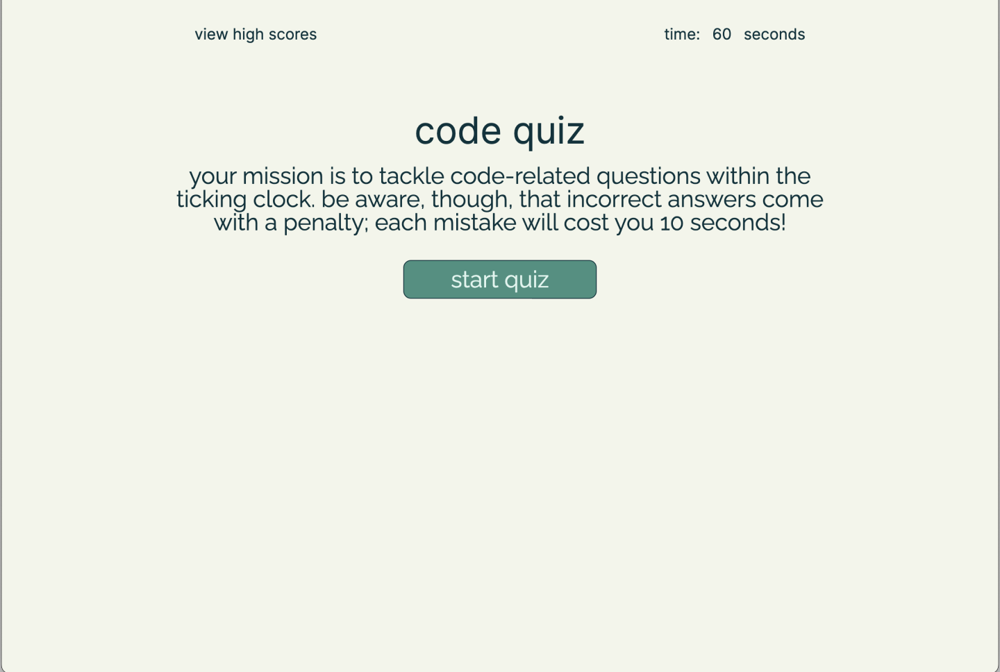
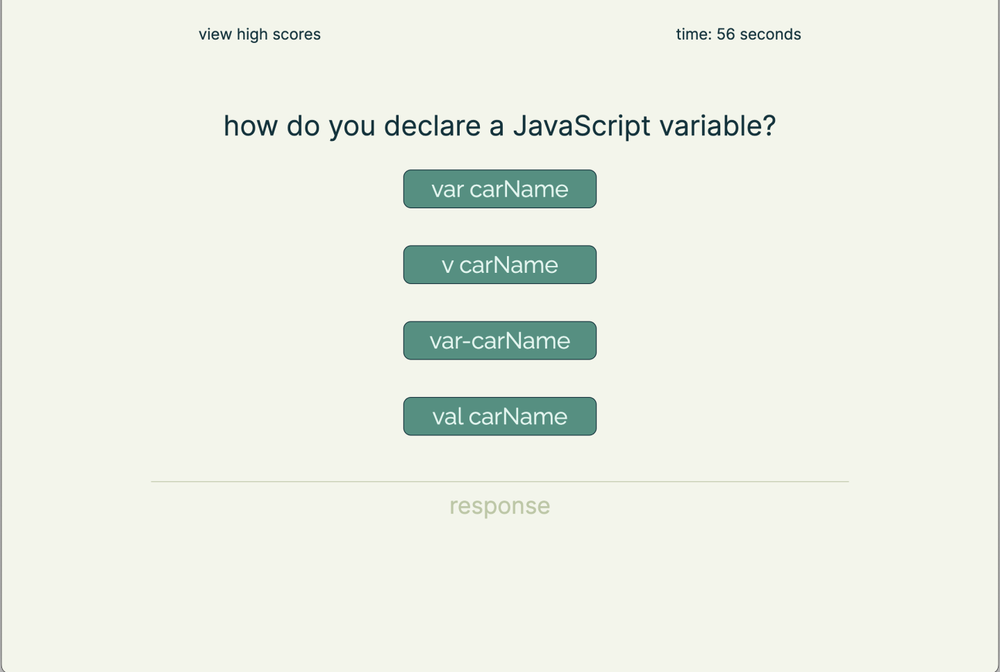
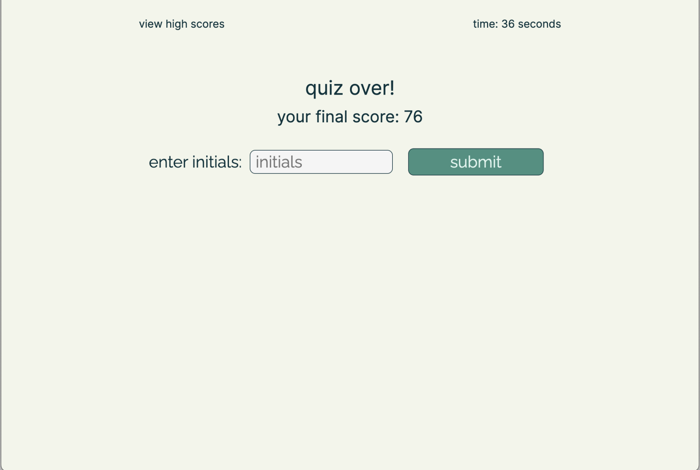
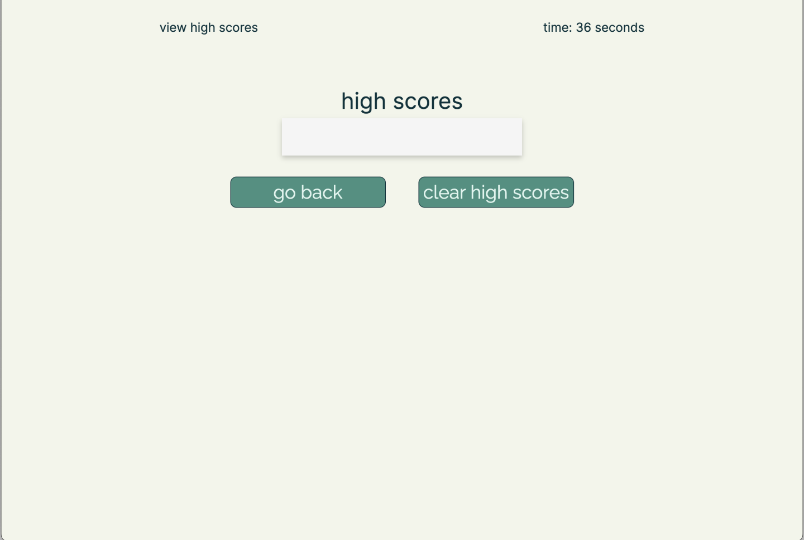

# js-fundamentals-quiz

## Description
This repository hosts the Module 04 Challenge. This repository contains a timed quiz designed for testing knowledge in JavaScript fundamentals.

## Instalation
N/A

## Usage
You can visit the live website by clicking on the following link:
 https://carlos-2mm.github.io/js-fundamentals-quiz/

A preview of the website:

## Credits

https://fonts.googleapis.com/css2?family=Inter&display=swap
 Serves as the resource for the Inter font.

https://fonts.googleapis.com/css2?family=Raleway&display=swap
 Serves as the resource for the Raleway font.

https://developer.mozilla.org/en-US/docs/Web/API/Document#events
The content provided by the Mozilla Developer Network (MDN) has been instrumental in understanding how event listeners work in JavaScript.

https://www.codecademy.com/resources/docs/javascript/methods
Resource for understanding JavaScript methods. Provided by Codecademy. Also reference for various JavaScript methods.

https://www.w3schools.com/java/java_methods.asp
The page provides a thorough understanding of what methods are in Java.

https://developer.mozilla.org/en-US/docs/Learn/JavaScript/Objects/JSON
This section helped understandimg how data is structured in JSON and the syntax rules need to follow.

https://www.w3schools.com/jsref/met_win_setinterval.asp
It explains that this function is used to call a function or evaluate an expression at specific intervals.

https://developer.mozilla.org/en-US/docs/Web/API/Window/localStorage
This section was useful for getting a high-level understanding of the API.

## License

Please refer to the LICENSE in repo.